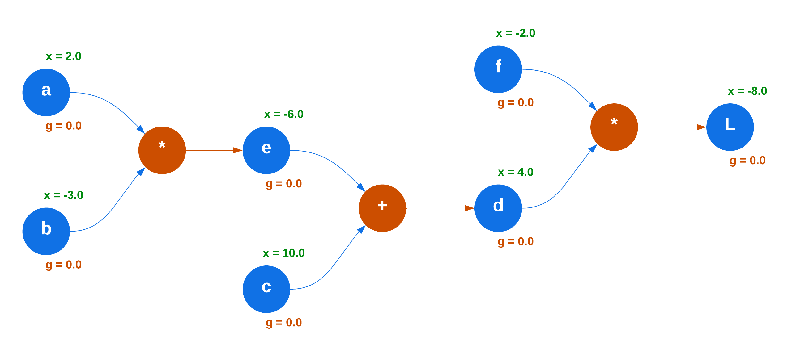

# Backpropagation

By definition, Neural Networks learn using a process called *backpropagation* where they use the Gradient Descent algorithm to pass a loss value backwards through the network using the chain rule from Calculus.

That's quite a lot to digest, so let's unpack a few of it's key points:

1. What is *Gradient Descent*?
2. What is a *gradient*?
3. Why do we need *gradient*'s in the first place?
4. What is the purpose of this *loss*?
5. How does the *chain rule* work?

Let's first start by understand *why* we need gradients.

## Why Gradient's are Used

The main goal of a Neural Network (NN) is to *learn patterns* or *relationships* from a set of input data in order to make predictions. This data can have one or multiple dimensions, and when we increase the number of dimensions, we increase the complexity of the data's relationships. Often, we work with multi-dimensional data and visualise it in high-dimensional space, such as Euclidean space, which is represented in three-dimensions - $(x, y, z)$. However, NNs can go beyond this and operate in spaces with hundreds of dimensions.

To be able to learn, NNs utilise *weights* and *biases*. Weights determine the strength of the connection between input features and the neurons in the network, while biases allow the model to shift its activation functions, to more flexibly separate and identify the relationships between data points.

To effectively make predictions, we need to minimise the difference between the network's predicted output and the actual one. We compute this difference using a *loss function*, which measures how well the model's predictions align with the true output. 

In basic arithmetic, we'd normally measure the difference between two values using *subtraction*. However, because we are using multi-dimensional data, subtraction alone isn't good enough. While it gives us a static difference between two values, indicating how much one differs from the other, it doesn't tell us *how the model should adjust its parameters* (weights and biases) to improve its predictions.

What we really need is a way to identify the change in *direction and magnitude* of the parameters in this high-dimensional space so we can minimize our loss. *Gradients* help us do that!

## Gradients

> A gradient represents the direction and magnitude of a function's rate of change. 

In our case, the *loss functions* rate of change. 

A gradient is either a *single* derivative or a *vector* of partial derivatives. When it's a:

1. *Single-variable* function - such as $f(x)$ - the gradient is a single derivative

$$
\nabla{f(x)} = \frac{d f(x)}{dx}
$$

2. *Multi-variable* function - such as $f(x, w)$ - the gradient is a vector of partial derivatives

$$
\nabla{f(x, w)} = 
\begin{bmatrix} 
    \frac{\partial{f}}{\partial{x}} \\ 
    \frac{\partial{f}}{\partial{w}} 
\end{bmatrix}
$$

Okay, that seems easy enough! So, how do we use this with *Gradient Descent*?

## Gradient Descent

<!-- To complete! -->
Remember, the relationships between are data are often very complex and non-linear to better reflect the real-world.

Okay, now let's go back to *gradients* and understand what *derivatives* and *partial derivatives* are.

## Derivatives

> A derivative measures the *instantaneous rate of change* of a function at a given point.

Let's say we have an arbitrary function $f(x)$ which performs the following calculation:

$$
f(x) = 3x^2 - 4x + 5
$$

If $x = 3$, then $f(x) = 20$, like so:

$$
f(3) = 3 * 3^2 - 4 * 3 + 5 = 27 - 12 + 5 = 20
$$

Simple enough, right? 

Now, what if we wanted to identify the rate of change between say $f(3)$ and $f(3.001)$? Such as, checking if the change is positive (up) or negative (down) in our dimensional space?

Well, we can use *derivatives*! To keep things simple, we will use an approximation of the derivative by computing the *slope* (rise over run) between these two points. We define this as:

$$
f'(x) = \lim_{h \to 0} \frac{f(x + h) - f(x)}{h}
$$

Where:

- $f'(x)$ - is the derivative of $f(x)$ at point $x$. This can also be denoted $\frac{df}{dx}$, indicating the rate of change of $f$ with respect to $x$
- $h$ - is a small change in $x$. The smaller $h$ gets, the closer we get to the true slope of the function at $x$
- $f(x + h)$ - the value of the function $f$ after $x$ has been shifted by $h$
- $f(x)$ - the value of the function $f$ at $x$
- $\lim_{h \to 0}$ - the *limit* of $f$ as the value $h$ approaches $0$

Using our $f(x)$ from before we can approximate our derivative with a small $h$, such as $h = 0.001$:

$$
\frac{df}{dx} \approx \frac{f(3 + 0.001) - f(3)}{0.001} = \frac{20.014003 - 20}{0.001} = \frac{0.014003}{0.001} = 14.003
$$

And there we go! Our derivative of our function with respect to $3$ is $14$.

### Partial Derivatives

??? info "Constant Rule Refresher"

    Consider the function $f(x) = c$, where $c$ is a constant. 

    No matter what the value of $x$ is, $c$ never changes. Remember, derivatives focus on the *rate of change*. If $c$ never changes, then it has to be a flat (horizontal) line, which means it doesn't have a *slope*. Without a slope, there is no *rate of change*, and without a rate of change, there is no movement, so the result is $0$. 

    $$
    \frac{d}{dx} c = 0
    $$

??? info "Derivative of Self Refresher"

    Consider the function $f(x) = x$.

    As $x$ changes, the function $f(x)$ changes at exactly the same rate. So, for every unit increase in $x$, $f(x)$ increases by the same unit. Now, let's consider the *rate of change* (slope) of this function.

    How fast does $x$ change with respect to itself? Well, it would be itself, right? So, the change is perfectly proportional, in other words it's $1$. The value has a $1:1$ relationship with itself. So, the derivative of itself is $1$.

    $$
    \frac{d}{dx}(x) = 1
    $$

So far, we've only looked at the derivative for a single variable, but what if we have multiple?

Let's take a simple equation as an example:

$$
d = ab + c
$$

??? tip "Look familiar?"

    It's very similar to a *simple linear regression* and a *single perceptron iteration*! 🤓

    $$
    \hat{y} = a + bx
    $$

    $$
    \hat{y} = g(\sum_{i = 1}^{m} x_i w_i + b)
    $$

Notice how $d$ now depends on multiple variables: $a$, $b$, and $c$. With what we've seen so far, there's no way we can calculate it's derivative! 

Hmmm... what if we break it down into smaller chunks, such as $d$ with respect to $a$? That would be a lot easier to work with, but we still need to figure out how to deal with $b$ and $c$. How about ignoring them entirely, and treat them as constant values of $0$? Now things become a lot simplier!

This is the idea behind *partial derivatives*!

> We measure the rate of change of a function with respect to one variable while setting the others as constants. 

Our notion changes a little here to use the $\partial$ symbol instead of $d$. For example, the partial derivation of $d$ with respect to $a$ is:

$$
\frac{\partial d}{\partial a}
$$

Let's see this in action! We'll start with the partial derivative above, $d$ with respect to $a$:

$$
\frac{\partial{d}}{\partial{a}} = \frac{\partial{(ab)}}{\partial{a}} + 0 = b
$$

??? example "Product Rule Example"

    Given the product rule for $ab$:

    $$
    \frac{\partial}{\partial{a}} (ab) = \frac{\partial}{\partial{a}}(a) \cdot b + a \cdot \frac{\partial{}}{\partial{b}}(b)
    $$

    We break it down into three steps -

    1. Calculate the derivative of $a$ with respect to $a$:

        $$
        \frac{\partial}{\partial{a}}(a) = 1
        $$

    2. Set $b$ as a constant, so it's derivative is $0$ based on the *constant rule*:

        $$
        \frac{\partial}{\partial{a}}(b) = 0
        $$

    3. Then we can calculate it fully:

        $$
        \frac{\partial}{\partial{a}}(ab) = 1 \cdot b + a \cdot 0 = b
        $$

        $1 \cdot b$ will always be $b$ and $a \cdot 0$ will always be $0$, and $b + 0 = b$. So, our final result is $b$!

We treat $b$ and $c$ as constants and we apply the *product rule* to $ab$, leaving us with $b$. 

Next, the partial derivative $d$ with respect to $b$:

$$
\frac{\partial{d}}{\partial{b}} = \frac{\partial{(ab)}}{\partial{b}} + 0 = a
$$

This time, we do the same thing but with $b$ instead of $a$ - we treat $a$ and $c$ as constants and apply the *product rule* to $ba$. 

And lastly, the partial derivative $d$ with respect to $c$:

First, we treat the term $a \cdot b$ as a constant:

$$
\frac{\partial{(ab)}}{\partial{c}} = 0
$$

Then, we get the derivative of $c$ with respect to itself:

$$
\frac{\partial{c}}{\partial{c}} = 1
$$

Put it all together, and we are left with $1$:

$$
\frac{\partial{d}}{\partial{c}} = 0 + 1 = 1
$$

Great! Now let's look how to apply these to a perceptron.

### Gradients

Let's increase the complexity and create a chain of equations with a final result as our loss $L$. We'll use four variables (nodes): $a = 2.0, b = -3.0, c = 10.0,$ and $f = -2.0$ with the equations:

$$
e = a \cdot b \quad\quad d = e + c \quad\quad L = d \cdot f
$$

For simplicity, let's visualise this as a node graph! 

We have two types of node: 

- Variables - coloured in blue, with a data value $x$ and gradient $g$
- And, operations - coloured in orange, such as multiplication ($*$) and addition ($+$)

Here we can clearly see the relationship between each node, and now start to visualise how we can pass *gradients* back through the graph.

> The gradient of a line (function) shows how steep it is

## Chain Rule

Here's what the chain rule looks like in Leibniz Notation:

$$
\frac{dy}{dx} = \frac{dy}{du} \frac{du}{dx}
$$

Where:

- $\frac{dy}{dx}$ is the derivative of $y$ with respect to $x$
- $\frac{dy}{du}$ is the derivative of $y$ with respect to $u$
- $\frac{du}{dx}$ is the derivative of $u$ with respect to $x$

### Summary

We use derivatives and gradients in backpropagation because of two main factors:

1. We are working with high-dimensional data that has complex relationships.
2. Our goal is to minimize a loss function in that high-dimensional space.

Derivatives tell us the *instantaneous rate of change* of a function at a given point, in our case how the *loss function behaves as we change the networks parameters (weights and biases)*. 

Partial derivatives allow us to measure the rate of change of a function for multiple variables by deriving one variable at a time while setting the others as constants.

Gradients ...
