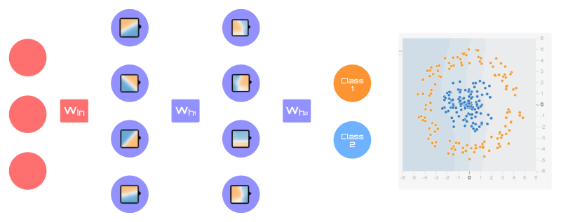

# Artificial Neural Networks

So far, we've seen algorithms that perform pretty well on small tasks, but quickly become useless in real-world problems because of the complex nature of the environment.

This is where Deep Learning comes into play. To start with, let's look at the most basic of networks - the *Artificial Neural Network (ANN)*.

## What Is a Neural Network?

A Neural Network (NN) is a type of Machine Learning algorithm, often called a model, that is made up of artificial neurons. Its main goal is to **learn patterns** or **relationships** from a set of data and use this information to make predictions for a given task, such as classification or regression.

There are many variants of NNs today, like Convolutional and Recurrent, but the one we will focus on is an *Artificial* one. It's the most basic NN and provides the foundation for any of its variants. You'll often find it called other names too, like *Feed-forward* and *Position-wise*, these all refer to the same thing.

<figure markdown="span">
    
    <figcaption>Figure 1.1. An Artificial Neural Network (ANN) with three layers (image by author)</figcaption>
</figure>

ANNs are made up of multiple neurons (nodes) that are stacked together into layers. Every network has 2 observable layers:

- **An input layer**: representing our input data
- **An output layer**: providing the networks prediction results

In between these layers, we add what are called **hidden layers**, these are what make NNs extremely powerful. We call these *hidden* because we have no direct control over them and don't directly observe them. These are strictly managed by the network and are used to generate its predictions.

Every node in these layers is densely connected with the nodes in the previous and succeeding layers, meaning that every node in one layer is connected with every other node in the layers around it. However, they are not connected to the nodes in the same layer. You can see an example of this in Figure 1.1.

This idea is inspired by the biological neurons inside the human brain and is the reason why networks can learn complex patterns and relationships. Not only that, but full connections allow the network to use various types of data, such as images, text and audio. They are completely universal! But that's not all - as you'll also see later, the mathematical model isn't as complex as you might think.

Okay, let's move on to a high-level understanding of how a neuron works.

## How A Neuron Works

In its simplest form, neurons are a value between a given range, such as $[0, 1]$ or $[0, \infty]$, depending on its activation function. These functions are crucial for providing non-linear behaviour to the model. We'll discuss these in more detail later.

The neuron's value is known as its *activation*. The network uses these *activation* values to understand how important the neuron is for making a new prediction.

<figure markdown="span">
    
    <figcaption>Figure 2.1. Neuron activity example (image by author)</figcaption>
</figure>

When the value is $0$, the neuron is inactive (off), and when it's at its maximum activation (such as $1$), it is fully activated. Full activation means that the pattern used by the neuron is highly relevant to the current prediction. Most of the time, neurons will have some level of activation.

### MNIST Example

<figure markdown="span">
    
    <figcaption>Figure 2.2. Example of handwritten digits from the MNIST dataset (image by [deeplake](https://datasets.activeloop.ai/docs/ml/datasets/mnist/))</figcaption>
</figure>

To get a better feel for how they work, let's look at a high-level example. Imagine we're trying to classify handwritten digits from the MNIST dataset, which includes digits ranging from 0 to 9. The model's goal is to correctly identify which digit is provided when passed in through the input layer.

In our output layer, we have 10 neurons, each representing the model's prediction for a specific digit. The value of each neuron shows the likelihood (probability) that the input is that digit. 

Let's say we already have a trained network, and we pass in an image of a 9. Our hope would be that each layer would correspond to a different piece of each number. Like in Figure 2.3, where the black nodes are inactive, the white is fully active, and the grey is partially active.

<figure markdown="span">
    
    <figcaption>Figure 2.3. Example of desired NN activations (image by [3Blue1Brown](https://www.youtube.com/watch?v=aircAruvnKk&list=PLZHQObOWTQDNU6R1_67000Dx_ZCJB-3pi))</figcaption>
</figure>

Logically, this would make sense. But unfortunately, we actually get intangible nonsense - or at least to us anyway 😅! 

<figure markdown="span">
    
    <figcaption>Figure 2.4. An example of neuron activation maps for some of the nodes in the second layer from Figure 2.3, where blue represents active focus (image by [3Blue1Brown](https://www.youtube.com/watch?v=IHZwWFHWa-w&list=PLZHQObOWTQDNU6R1_67000Dx_ZCJB-3pi&index=2))</figcaption>
</figure>

You may be wondering: "*Why?*" Well, that boils down to the complexity and dimensionality of the data. In Figure 2.4, the activation maps are shown as two-dimensional plots. If they were three-dimensional, things would look a lot different. Anything beyond three-dimensional is extremely hard to visualise. NNs often operate in spaces with hundreds of dimensions, so what they "see" is vastly different to what we can even begin to comprehend. 

Let's talk more about that next.

## Data and Dimensionality

So, what is the term *dimensionality* and how does it relate to our network? 

The best way to explain it is through an example. Consider a spreadsheet of data with four columns: *Credit Score*, *Geography*, *Age*, and *Balance*.

| CreditScore | Geography | Age      | Balance  |
|:-----------:|:---------:|:--------:|:--------:|
| 619         | France    | 42       | £264.06  |
| 608         | Spain     | 41       | £838.86  |
| $\cdots$    | $\cdots$  | $\cdots$ | $\cdots$ |

Each one of these columns represents a unique measurable property of information, often referred to as a *feature*, *attribute*, or *variable*. 

If we were to pass this data into our NN, we would have a four-dimensional dataset because each feature contributes to a new dimension in a mathematical space. In practice, we represent our input features by the letter $X$ and express them as a matrix, like so:

$$
X = \begin{bmatrix}
        x_{1,1} & x_{1,2} & x_{1,3} & x_{1,4} \\
        x_{2,1} & x_{2,2} & x_{2,3} & x_{2,4} \\
        \vdots & \vdots & \vdots & \vdots \\
        x_{m,1} & x_{m,2} & x_{m,3} & x_{m,4}
\end{bmatrix} \tag{2.1}
$$

??? info "Geography Column"

    Since the *Geography* column is a categorical variable, we would need to convert it into a numerical representation to feed it into the network properly and plot it effectively. One technique is to use one-hot encoding, or you can simply assign integers to each category. 
    
    We'll leave that for another tutorial!

We define the shape of a matrix by its dimensions *(row, column)*. So, starting from the top-left corner we count *(down, right)*. This is also referred to as an *$m$-by-$n$* matrix - $m$ for the number of rows and $n$ for the number of columns. 

Each *column* is one dimension of the data in the matrix, while each *row* is a separate point in high-dimensional space. We can't visualise this with four dimensions, but we can with two and three, as shown in Figure 3.1.

<figure markdown="span">
    
    <figcaption>Figure 3.1. Examples of a 2D (left) and 3D (right) space (image by author)</figcaption>
</figure>

The main point of these plots is to illustrate what a mathematical space looks like. The points themselves are completely arbitrary, so don't panic if they seem confusing! We'll talk about the dividers shortly.

Going back to our matrix, if we only had two dimensions, let's say the first two columns (Credit Score and Geography), how would we plot these? Well, we'd follow the basic principles of geometry - take the value at the *horizontal* axis (x-axis) and then the *vertical* axis (y-axis), so a single data point in space would be: 

$$
(x_{1,1}, x_{1,2}) = (619, \text{France}) \tag{2.2}
$$ 

In three dimensions, you'd just extend it to the extra column (Age) and plot it on the z-axis:

$$
(x_{1,1}, x_{1,2}, x_{1,3}) = (619, \text{France}, 42) \tag{2.3}
$$

Then, with higher dimensions, the same behaviour would be repeated. Now, what's really interesting about a network's neurons is how they handle these data points. 

??? info "Decision Boundaries"

 Decision boundaries have different names depending on the dimensionality of your data. Here's a brief summary:

 - In two dimensions, we call it a *line*
 - In three dimensions, a *plane*
 - And, in four or more ($n$-dimensions), a *hyperplane*

See the blue dividers between the two categories? These are called *decision boundaries* and each neuron creates one to separate the data into type $a$ or $b$.

This applies to *all* dimensions, and regardless of how many there are, the boundary will always classify the data between two categories. In other words, a neuron is either *active* or *inactive* based on this classification.

🤯 Amazing, right?! But, wait... if they only perform binary classification, how do they manage to learn such complex patterns? Now's a good time to address its mathematical model - the *perceptron*.

## Perceptron

### Hypothesis

To confirm this hypothesis, let's consider a foundational model in statistical analysis: *linear regression*. 

Bear with me here! In a simple linear regression, we formulate the relationship between an input feature $x$ and a continuous output $y$. We mathematically express it as:

$$
\hat{y} = mx + b \tag{3.1}
$$

Where $m$ is the slope of the line and $b$ is where the line crosses the y-axis (y-intercept). Now, there are a few issues with this. $x$ is only *one* feature and our output value is always continuous. But, what if we were to expand on this idea? 

Let's revisit what we've previously discussed:

1. We need a way to create complex patterns, which requires multiple features
2. We need our output within a range suitable for classification, such as a probability distribution $[0, 1]$

For our first point, what if we added more features, like in *multiple linear regression*? That could work! We just expand our features to $x_n$, but what about the slope? That makes things a lot trickier.

Now that we have multiple features, we're creating a higher dimensional space, so we need a way to understand how each input feature contributes to the model's prediction. Let's try adding a *weight* value to each feature $w_n$ based on it's importance, like so:

$$
\hat{y} = w_1 x_1 + w_2 x_2 + \cdots + w_n x_n + b \tag{3.2}
$$

Okay, this solves our first problem, but how do we change it from a continuous output to something we can use for classification? Well, as we're looking for a probability distribution, why don't we use a function to transform our output into a more suitable scale? We can try this with *logistic regression*.

Common for binary classification, it uses a sigmoid function to map its linear values into a range between $[0, 1]$. Formulated:

$$
S(z) = \frac{1}{1 + e^{-z}} \tag{3.3}
$$

Where $z$ is the linear combination of inputs that takes $x_n$ number of features, $w_n$ number of weights, and a bias term $b$ that shifts the decision boundary away from the origin $(0, 0)$ to help classify more complex features:

$$
z = w_1 x_1 + w_2 x_2 + \cdots + b = \sum^{m}_{i = 1}w_i x_i + b \tag{3.4}
$$

Notice how $z$ is identical to $\hat{y}$ in our multiple linear regression.

What if I told you this is exactly what a perceptron is? It's almost too good to be true, right? Something that simple can't possibly be what drives a NN! Well, it is! 😁 Or, at least the first part! Let's take a look.

### Implementation

<figure markdown="span">
    
    <figcaption>Figure 4.1. A diagram of the perceptron process (image by author)</figcaption>
</figure>

To start with, we take a vector of features $x_n$ and multiply them by a corresponding set of weights $w_n$ (one per feature). This operation scales each feature by its respective weight value, controlling the *orientation* and *slope* of the decision boundary by "tilting" it. 

Next, we add a bias $b$ to the result, which shifts the boundary away from the origin of the data points, perpendicular to its orientation. This movement acts as a threshold for adjusting its activation status (*active* or *inactive*). If the bias is negative, it increases the threshold, meaning the perceptron needs a larger weighted sum to produce a *full-activation*. Conversely, a positive bias lowers the threshold, allowing activation with smaller weighted sums. 

Their effect looks different depending on the dimensionality of the data:

- **In two dimensions**: Weights control the slope of the decision boundary (line), determining its orientation, while the bias shifts the line *left/right* or *up/down*, moving the boundary without changing its slope
- **In three dimensions**: Weights control the tilt and orientation of the decision boundary (plane) and the bias shifts the plane in any direction (*forward/backward*, *left/right*, *up/down*)
- **In n-dimensions (4+)**: Weights control the orientation of the decision boundary (hyperplane), and the bias shifts it perpendicularly in the multidimensional space

At this point, our boundary is still a flat (linear) plane, but what we really need is a non-linear one. That's where our activation function comes in. By passing the weighted sum through an activation function $g$, we modify the shape of the decision boundary to capture more complex patterns. Picture this as sculpting a piece of clay; the activation function morphs the decision boundary to better fit the data points. 

This results in a single output value $\hat{y}$. What that value is entirely depends on what type of activation function you use.

<figure markdown="span">
    
    <figcaption>Figure 4.2. A comparsion between linear (left) and non-linear activation functions (right) outputs (image by [Alexander Amini](https://youtu.be/ErnWZxJovaM?si=r1ImQW-7EUPwPXVe&t=1464))</figcaption>
</figure>

Here's the perceptron's mathematical expression:

$$
X = \begin{bmatrix}
x_1 \\
x_2 \\
\vdots \\
x_n
\end{bmatrix} 
\quad\quad
W = \begin{bmatrix}
w_1 \\
w_2 \\
\vdots \\
w_n
\end{bmatrix} \tag{3.5}
$$

$$
\hat{y} = g(X \cdot W + b)
$$

There are numerous activation functions available, with one of the most common being the Rectified Linear Unit (ReLU). While we won't delve into the specifics here, it's important to understand that their primary function is to introduce non-linearity to the model so it can learn complex patterns in the data.

You may be wondering: "*Why do we only have a single weight per feature (column) and not sample (row)?*" Well, think about it - if we have a dataset of 500 rows and 5 columns, mapping the weights to our rows would give us 500 weights instead of just 5. That's 100x more values to compute!

More importantly, this would cause the perceptron to learn the unique patterns of each individual sample rather than identifying the general patterns across the feature. A single weight per feature provides a more robust way to capture the relationship between each feature and the predicted output. This also helps the model generalise more effectively to unseen data, which is exactly what we want in real-world applications.

So, in essence, all a perceptron is doing is optimising a decision boundary using a set of parameters (weights and biases) around the input data. It's remarkable how such a simple mechanism can be so powerful, particularly when combining it with other perceptrons! Let's explore that next.

## Forward Pass

Now that we have an understanding of a single neuron (perceptron), let's see what happens when we chain them together.

Consider a small network with:

- 2 hidden layers - 4 neurons each
- 2 output nodes
- And, Tanh activation function for all nodes - outputs bound between $[-1, 1]$

We'll use [Tensorflow's Playground :material-arrow-right-bottom:](https://playground.tensorflow.org/#activation=tanh&batchSize=10&dataset=circle&regDataset=reg-plane&learningRate=0.001&regularizationRate=0&noise=0&networkShape=6,6,2&seed=0.34949&showTestData=false&discretize=false&percTrainData=50&x=true&y=true&xTimesY=false&xSquared=false&ySquared=false&cosX=false&sinX=false&cosY=false&sinY=false&collectStats=false&problem=classification&initZero=false&hideText=false) to help with this and the diagram in Figure 4.3.

Imagine our dataset is arranged in a circular pattern, where we want to split it into two distinct classes: one for the points inside the circle and another for the points forming an outer ring around it. The goal of our NN is to create a clear distinction between these two classes.

<figure markdown="span">
    
    <figcaption>Figure 4.3. A simple Neural Network (image by author with [TF Playground :material-arrow-right-bottom:](https://playground.tensorflow.org/#activation=tanh&batchSize=10&dataset=circle&regDataset=reg-plane&learningRate=0.001&regularizationRate=0&noise=0&networkShape=6,6,2&seed=0.34949&showTestData=false&discretize=false&percTrainData=50&x=true&y=true&xTimesY=false&xSquared=false&ySquared=false&cosX=false&sinX=false&cosY=false&sinY=false&collectStats=false&problem=classification&initZero=false&hideText=false) elements)</figcaption>
</figure>

For this example we won't worry about the number of input features, they don't matter in this instance, so we'll set them arbitrarily to three. We'll also randomly initialise our network's parameters (weights and biases). This is crucial for each neuron to start with its own distinct pattern.

Now let's take a look at the diagram (Figure 4.3). In it, each node (circle) represents a single perceptron that is densely connected with its previous layer. To keep the diagram clear, we simplify the weight connections as labelled boxes rather than individual lines. 

In our first hidden layer, we can imagine our network acts as a linear classifier, creating decision boundaries similar to those shown in each node. But what's really interesting, is how they start to morph when their output is passed through multiple layers!

Notice how in the second layer the decision boundaries have shifted slightly? That's because they are combining and transforming the outputs from the previous layer, learning a more complex and unique boundary! This same process repeats for the output layer, refining the boundaries even further.

This process is known as the *forward pass* of the network, where the input features are propagated forward through the network, neuron by neuron, ultimately producing a prediction in the output layer. It's essential for generating network predictions and is how we perform inference on unseen data. However, if we were to use the network in its current state with only randomly initialised parameters, our predictions would be meaningless! 

What we need is to somehow optimise these parameters so they can better fit our data. We achieve this through a process called *backpropagation*. We'll dive into this in the next section. See you there!

## Backpropagation

*Note: Backpropagation uses some fundamental concepts of differential calculus, so you might see a few equations that look a bit complicated. But don't panic! We'll go through everything you need to know to make sense of them. As long as you're comfortable with basic arithmetic (+, -, *, /), you'll be just fine!*

You know how in the Olympics, athletes make the sport they are competing in look really easy? Behind that ease is a lot of practice and fine-tuning, and that's similar to how backpropagation works!

In our case, we start by performing a forward pass to make a prediction $\hat{y}$, as we've already seen. We then feed this prediction through a loss/cost function $L$, comparing it to the actual output $y$ (the ground truth) to see how far off we are. For now, let's use Mean Squared Error (MSE) as an example:

$$
L(\hat{y}, y) = \frac{1}{n} \sum_{i=1}^{n} (\hat{y}_i - y_i)^2
$$

This function returns a *loss* value, which we then use to compute its *gradients* (the rate of change) for each parameter. These gradients measure the parameters' contribution to the error and are the fundamental piece that helps the network learn. We propagate these gradients back through the network, one neuron at a time, using them to make small adjustments to our parameters so the model can improve over time - just like how athletes refine their skills through feedback and practice!

Now, there are a few things here that we need to unpack, so let's break this down into some key questions to answer:

1. What is a *gradient*?
2. Why do we need *gradients* in the first place?
3. How do we propagate them through the network? I.e., what is the algorithm used?

Let's first start by understanding *why* we need gradients.

### Why Use Gradients?

Recall that the main goal of an NN is to *learn patterns* or *relationships* from a set of input data in order to make predictions. As we've just discussed, we need to minimise the difference between the network's predicted output and the actual one. 

Now, remember earlier that in the [Perceptron: Hypothesis](#hypothesis) section, we mentioned that perceptrons act similarly to linear regressions with slopes? Let's take a minute to go back to that idea and imagine that the network's *parameters* are actually like a hilly landscape. If we're trying to minimise our loss, then surely we'd want to find the lowest point in this landscape? This would represent our optimal set of parameters that lead to the smallest possible error.

In basic arithmetic, we'd normally measure the difference between two values using *subtraction*. However, because we are in a hilly landscape, subtraction alone isn't good enough. While it tells us how much one differs from the other, it doesn't tell us the *direction* to move nor the *size* (magnitude) of our step in the landscape that reduces the error. So, we need to use something else that helps us measure the *change* of our loss between network iterations.

Calculus is the mathematical study of change, so it makes perfect sense for our optimisation problem! And gradients, well, they measure the *rate of change* of a function - our loss function. 

### Gradients

> A gradient represents the direction and magnitude of a function's rate of change.

